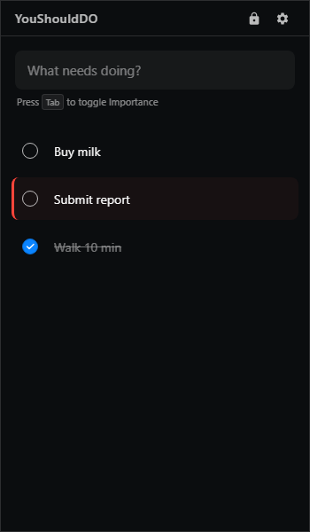

# YouShouldDO

这是一个使用 Electron 开发的高效任务管理应用。

## 预览

### 软件界面

<p align="center">
    
</p>

### 使用演示

<p align="center">
    <strong>添加事项</strong><br />
    
</p>

<p align="center">
    <strong>删除事项</strong><br />
    
</p>

## 下载与发布

你可以在 [GitHub Releases](https://github.com/CreatorOfBucket/YouShouldDO/releases) 页面找到最新的版本并下载 **Windows 安装包**（推荐）或查看发行说明。

- **最新正式版本（Windows 安装包）**: [v1.0.3](https://github.com/CreatorOfBucket/YouShouldDO/releases/tag/v1.0.3)

### Windows 用户（推荐）

1. 打开 Releases 页面，进入最新版本（如 v1.0.3）。
2. 下载并运行安装包：`YouShouldDO Setup 1.0.3.exe`。
3. 按向导安装后即可使用。

## 部署说明

以下内容面向开发者（从源码运行）。普通用户请优先使用上面的 Windows 安装包。

### 1. 环境准备
确保你的电脑上已经安装了 [Node.js](https://nodejs.org/) (建议使用 LTS 版本)。安装 Node.js 后，`npm` 也会自动安装。

### 2. 克隆/下载代码
如果你使用 Git，可以运行：
```bash
git clone https://github.com/CreatorOfBucket/YouShouldDO.git
cd YouShouldDO
```
或者直接从 GitHub 下载项目的 ZIP 压缩包并解压。

### 3. 安装依赖
在项目根目录下（即包含 `package.json` 的目录）打开终端（如 PowerShell, CMD 或 Terminal），运行：
```bash
npm install
```
这将根据 `package.json` 文件自动下载项目运行所需的所有库（包括 Electron）。由于我们在上传时排除了 `node_modules`，这一步是必须的。

### 4. 运行程序
安装完成后，运行以下命令启动应用：
```bash
npm start
```

## 技术栈
- **核心框架**: Electron
- **前端技术**: HTML5, CSS3, JavaScript (Vanilla ES6+)
- **任务逻辑**: 响应式任务管理与提醒

## 注意事项
- 如果你在运行 `npm install` 时遇到网络问题，可以尝试使用镜像源（如 `npm config set registry https://registry.npmmirror.com`）。
- 确保你的 Node.js 版本支持最新的 Electron（建议 Node.js 18+）。

---
由 Antigravity 助手协助构建。
